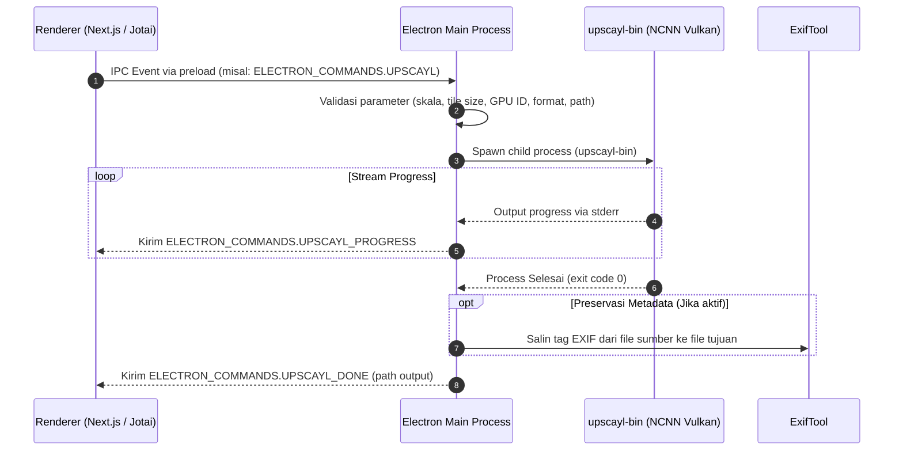
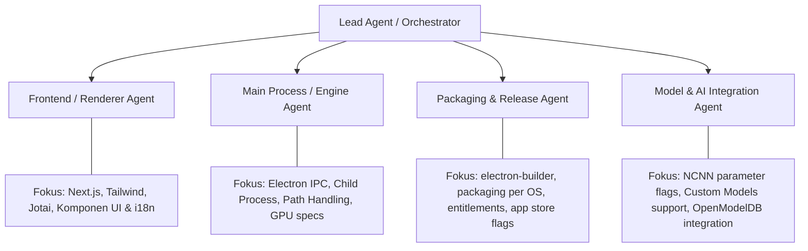

# AGENTS.md — Dokumentasi Arsitektur & Panduan Operasional AI Agents

> Dokumen ini dirancang sebagai panduan referensi menyeluruh bagi AI Coding Agents (dan pengembang) yang bekerja pada repositori **Upscayl**. Harap baca dan patuhi panduan, batasan arsitektur, serta pembagian peran sebelum melakukan modifikasi kode.

---

## 1. Analisis Proyek & Arsitektur Sistem

### 1.1 Ringkasan Proyek
- **Nama Aplikasi**: Upscayl (v2.15.0)
- **Kategori**: Desktop Application (Cross-Platform: Windows, Linux, macOS)
- **Lisensi**: AGPL-3.0
- **Fungsi**: AI Image Upscaler luring (offline) yang memanfaatkan model Deep Learning untuk memperbesar dan meningkatkan kualitas gambar tanpa mengunggah data pengguna ke server luar (100% lokal & privat).

### 1.2 Tech Stack & Komponen Kunci
- **Desktop Framework**: Electron (v33.x)
- **Frontend Framework**: Next.js (v15.x) + React (v18.x) (diekspor secara statis via `electron-next`)
- **Styling**: Tailwind CSS, DaisyUI, Radix UI Primitives, Lucide Icons
- **State Management**: Jotai (atomic state)
- **AI Inference Engine**: `upscayl-bin` (port C++ NCNN Vulkan berbasis Real-ESRGAN / Real-CUGAN)
- **Image & Metadata Handling**: Sharp, ExifTool (`exiftool-vendored`)
- **Build / Packaging Tool**: `electron-builder`

### 1.3 Pola Komunikasi Antar-Proses (IPC Flow)
Arsitektur Upscayl memisahkan logika UI (Renderer) dan eksekusi sistem (Main Process) secara ketat:



---

## 2. Peta Direktori & Tanggung Jawab

| Direktori | Deskripsi & Batasan Modifikasi |
| :--- | :--- |
| `electron/` | **Main Process**: Mengatur jendela aplikasi, lifecycle, protokol kustom (`file://`, `public://`), auto-update, dan eksekusi binary CLI. **Dilarang mengimpor komponen UI React di sini.** |
| `electron/commands/` | Handler untuk setiap perintah IPC seperti `image-upscayl.ts`, `batch-upscayl.ts`, `double-upscayl.ts`, `select-file.ts`, dll. |
| `electron/utils/` | Utilitas pembantu: path resolving, formatting argumen CLI (`get-arguments.ts`), deteksi GPU, dan spawning child process. |
| `renderer/` | **Renderer Process**: Aplikasi Next.js/React. **Dilarang memanggil modul native Node.js (seperti `fs`, `child_process`) secara langsung.** Semua interaksi sistem harus lewat IPC. |
| `renderer/atoms/` | Definisi global state menggunakan Jotai (`user-settings-atom.ts`, `log-atom.ts`, dll.). |
| `renderer/components/` | Komponen visual: sidebar kontrol, slider before/after (`react-compare-slider`), dialog pengaturan, modal onboarding. |
| `common/` | Shared types, konstanta IPC (`electron-commands.ts`), daftar model bawaan (`models-list.ts`), dan feature flags (`feature-flags.ts`). |
| `resources/` | Binary executable per OS (`resources/{os}/bin/`) dan bobot model AI (`resources/models/`). **Jangan ubah file biner kecuali ada pembaruan versi engine.** |

---

## 3. Protokol & Kebutuhan AI Agents

Bagi AI Agent yang melakukan tugas pengembangan, perbaikan bug, atau penambahan fitur baru pada repositori ini, patuhi instruksi berikut:

### 3.1 Lingkungan & Eksekusi Script
- **Node.js**: Gunakan Node.js versi 18.x (dikelola via Volta: `18.20.5`).
- **Development Run**:
  ```bash
  npm run dev # atau npm start (menjalankan tsc & electron .)
  ```
- **Type Checking**:
  ```bash
  npm run tsc
  ```
- **Validasi Skema**:
  ```bash
  npm run validate-schema
  ```
- **Build / Packaging Target**:
  - Windows: `npm run dist:win`
  - Linux: `npm run dist:linux` (atau `dist:appimage`, `dist:deb`, `dist:flatpak`)
  - macOS: `npm run dist:mac` / `npm run dist:mas`

### 3.2 Aturan IPC (Inter-Process Communication)
1. **Gunakan Konstanta Terpusat**: Semua nama channel IPC wajib didaftarkan di `common/electron-commands.ts`. Jangan melakukan hardcoding string event IPC di file handler atau komponen.
2. **Kesesuaian Channel**:
   - Untuk operasi yang membutuhkan pengembalian nilai langsung (request-response synchronous/asynchronous), gunakan `ipcMain.handle()` dan `ipcRenderer.invoke()`.
   - Untuk operasi berulang atau streaming (progress, logs, status), gunakan `ipcMain.on()` dan `mainWindow.webContents.send()`.
3. **Pembersihan Child Process**: Pastikan proses `upscayl-bin` selalu ditutup (`kill()`) jika terjadi error, pembatalan (`ELECTRON_COMMANDS.STOP`), atau saat jendela aplikasi ditutup.

### 3.3 Penanganan Path & Kompatibilitas Lintas Platform
1. **Pemisah Path (Slash)**: Windows menggunakan backslash (`\`) sedangkan POSIX menggunakan forward slash (`/`). Gunakan helper `slash.ts` atau modul `path` bawaan Node.js.
2. **Encoding URI**: Path file dari renderer sering kali berupa URI (`file://` atau ter-encode). Selalu gunakan utilitas `decodePath()` sebelum mengirim path ke sistem file atau argumen CLI.
3. **Batas Panjang Path Windows**: File path pada Windows memiliki batas standar MAX_PATH (~255-260 karakter). Selalu periksa panjang `outFile` seperti yang diimplementasikan pada `image-upscayl.ts`.

### 3.4 Penanganan Memory & VRAM (GPU)
- Inferensi NCNN Vulkan membutuhkan memori kartu grafis yang signifikan.
- Jika pengguna memproses gambar beresolusi tinggi, parameter `-t` (*tile size*) harus dapat dikonfigurasi (misal: 0, 100, 200, 400). Nilai tile size yang lebih kecil mencegah error Out of Memory (OOM) pada GPU dengan VRAM terbatas.

---

## 4. Pembagian Peran Agen (Agent Roles & Specialization)

Jika tugas didelegasikan ke sub-agen atau agen dengan spesialisasi terpisah, gunakan panduan peran berikut:



1. **Lead Orchestrator**:
   - Menganalisis kebutuhan pengguna, memverifikasi dependensi antar-modul, dan menguji build keseluruhan.
2. **Frontend / Renderer Agent**:
   - Beroperasi di direktori `renderer/`.
   - Bertanggung jawab atas desain visual, interaktivitas slider, tata letak responsif, lokalisasi bahasa (`renderer/locales/`), dan interaksi state atom Jotai.
3. **Main Process / Engine Agent**:
   - Beroperasi di direktori `electron/` dan `common/`.
   - Bertanggung jawab atas lifecycle background, penanganan sinyal exit child process, spawning `upscayl-bin`, dan preservasi metadata EXIF.
4. **Packaging & Release Agent**:
   - Beroperasi di `package.json`, konfigurasi `electron-builder`, serta script validasi.
   - Mengelola perbedaan build FOSS vs Mac App Store (`FEATURE_FLAGS.APP_STORE_BUILD`).
5. **Model & AI Integration Agent**:
   - Mengatur integrasi model baru, validasi file `.param` dan `.bin`, format output gambar, dan komputasi skala model di `common/check-model-scale.ts`.

---

## 5. Checklist Verifikasi Sebelum Menyerahkan Kode

Sebelum menyelesaikan tugas atau merge PR, AI Agent wajib memverifikasi:
- [ ] `npm run tsc` lolos tanpa kompilasi error.
- [ ] Tidak ada pemanggilan modul Node.js langsung dari folder `renderer/`.
- [ ] Semua nama event IPC terdaftar di `common/electron-commands.ts`.
- [ ] Penanganan path aman untuk Windows, Linux, dan macOS.
- [ ] Child process NCNN ditangani dengan aman (dapat dihentikan sewaktu-waktu oleh pengguna tanpa memory leak).
- [ ] Komentar dan struktur dokumentasi asli tetap dipertahankan.
